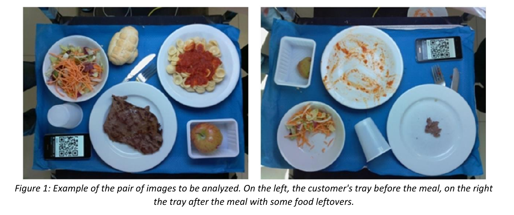
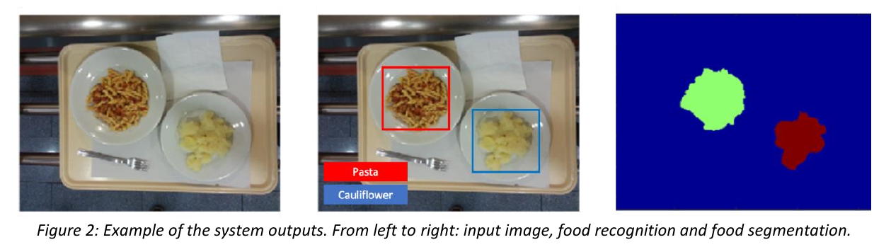

# Food recognition and leftover estimation

## Problem Introduction
Food waste is an important problem in today's society, with several negative impacts such as waste of
valuable food, waste of natural resources used to produce it and the cost of organic waste management.
Once prepared, food is often not fully consumed leading to a large amount of wasted resources very evident especially in work and school canteen settings. Some of the main causes are lack of culture of respect for food, over-ordering of food, and lack of attention to portions by the canteen staff. By introducing a system for scanning the consumer's tray at the end of the meal, food leftovers could be analyzed to discourage waste and monitor consumers' habits.

The goal of this project is to develop a computer vision system capable of scanning a canteen consumer's
food tray at the end of a meal to estimate the amount of leftovers for each type of food. Such a system must be able to analyze pairs of images: one of the tray before the meal and one of the tray at the end of the meal. From the first image, the system will recognize the various types of food ordered, keeping track of the initial quantity of each food; at the end of the meal, the system must analyze a new image of the tray, recognizing which types of food are still present and in what quantity.

In more detail, the system to be developed should be able to 1) recognize and localize all the food items in the tray images, considering the food categories detailed in the dataset; 2) segment each food item in the tray image to compute the corresponding food quantity (i.e., amount of pixels); 3) compare the “before meal” and “after meal” images to find which food among the initial ones was eaten and which was not. The leftovers quantity is then estimated as the difference in the number of pixels of the food item in the pair of images.

